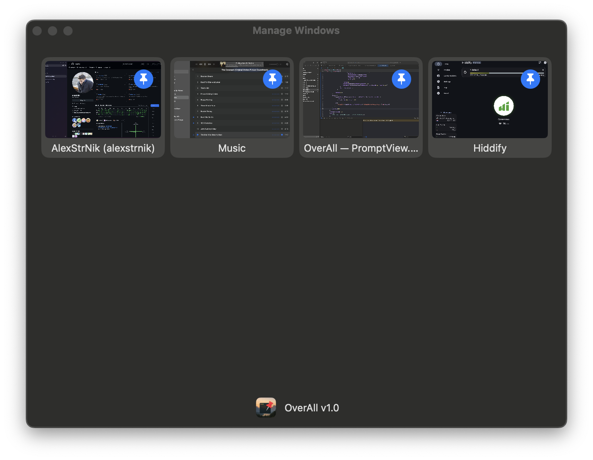

# OverAll



**OverAll** is a lightweight macOS utility that allows you to pin any window—even those protected by DRM or system-level restrictions—directly to the top of your screen. Unlike TopIt, which captures and streams window content to a floating proxy panel, OverAll modifies the window's level within the system, leaving rendering to macOS itself. This approach results in virtually zero CPU/GPU usage.

## Security Warning

OverAll utilizes private macOS APIs and requires disabling critical security features:

- **SIP (System Integrity Protection)**
- **AMFI (Apple Mobile File Integrity)**

**Disabling these protections significantly reduces your Mac's security. Proceed at your own risk.**

## Disabling SIP & AMFI

If you still wish to proceed:

1. **Boot into Recovery Mode**: Hold **Command (⌘) + R** during startup
2. **Open Terminal** and execute:

   ```sh
   csrutil disable  # Disables SIP
   nvram boot-args="amfi_get_out_of_my_way=0x1"  # Disables AMFI
   ```

3. **Reboot your Mac**.

## Features

- **System-Level Pinning** Pin any window, including those protected from screen capture.
- **Minimal Resource Usage** Virtually zero CPU/GPU overhead.
- **Native Integration** Leverages macOS's window management for seamless operation.

## Limitations

- **Security Requirements** Necessitates disabling SIP and AMFI.
- **Potential Instability** Use of private APIs may lead to unexpected behavior.
